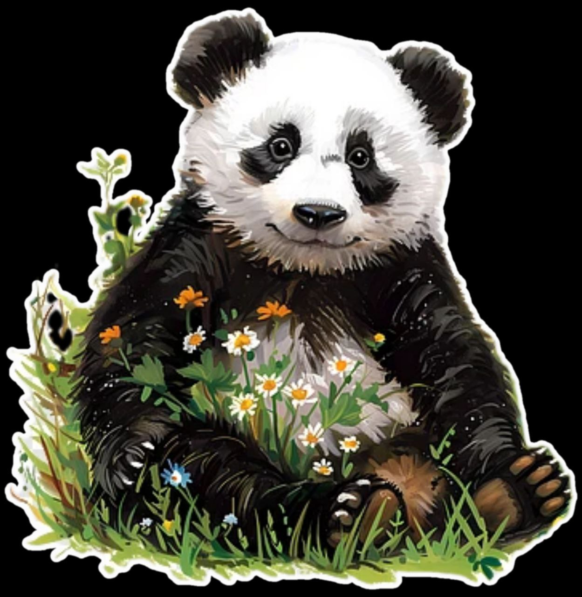
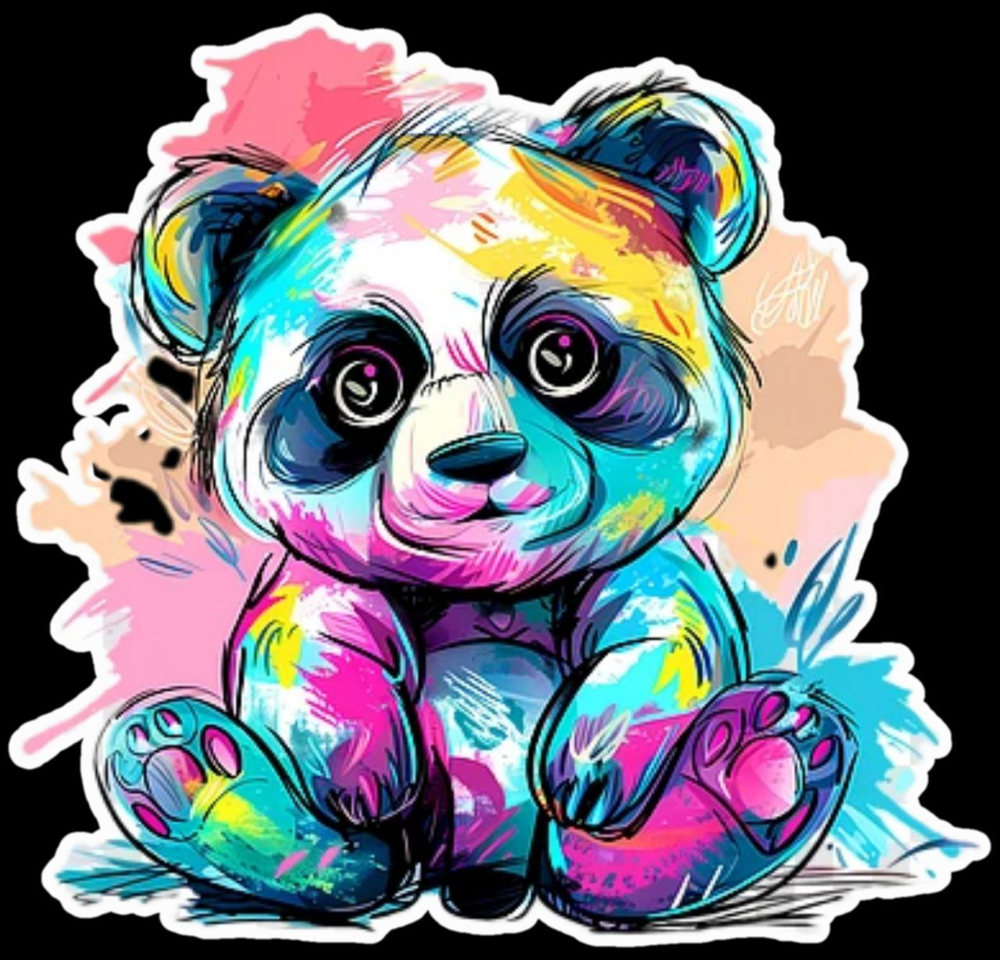

<head>
<meta charset="utf-8">
 <meta name="viewport" content="width=device-width, initial-scale=1.0">
<link href="https://fonts.googleapis.com/css2?family=Amatic+SC:wght@400;700&family=Lora:wght@400;700&display=swap" rel="stylesheet">
<link rel="icon" type="image/png" sizes="16x16" href="images/favicon.jpg">
<link rel="icon" type="image/png" sizes="32x32" href="images/favicon1.jpg">
<link rel="apple-touch-icon" sizes="180x180" href="images/favicon2.jpg">
<meta name="description" content="Often known as evolutionary mistake for being too fragile for the survival race in this unforgiving world, Panda still lives with it's well known love for the bamboos and untimely naps!" />
<meta property="og:image" content="images/panda42.jpg">
<link rel="stylesheet" type="text/css" href="main.css" />
<title>
Bamboo Diaries
</title>
</head>
<body>
<h1> <a href="https://bamboodiaries.github.io">Bamboo Diaries</a></h1>

 To not let the childhood die! 

 
 

<ul>

<li>
<a href="#">Wilderness|</a> </li>

<li><a href="#">Nights|</a> </li>

<li> <a href="#">Wander|</a> </li>

<li> <a href="#">About|</a> </li>
</ul>

 

<h2 style="text-align:left;"> Recently in the wilderness: </h2>

 
Diwali and the howling Jackals! 

<small> 2025-10-20 </small>

 

 
Depressed panda finds a way! 

<small> 2025-10-20 </small>

 After a long time the panda has found a way out of his depressing thoughts and he is filled with joy. He awaits the right time to pounce now, panda is in love with the Art now!

 

 
Panda is in love with the colors 

<small> 2025-10-20 </small>

