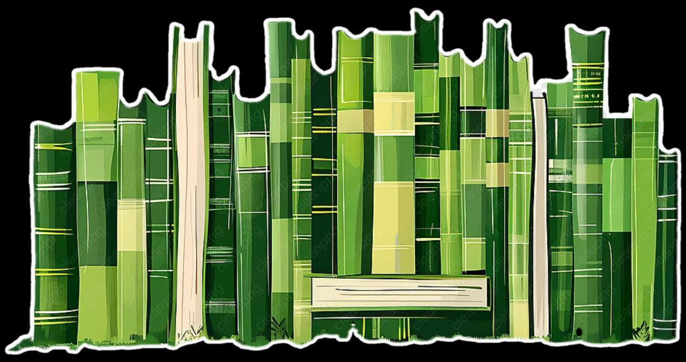
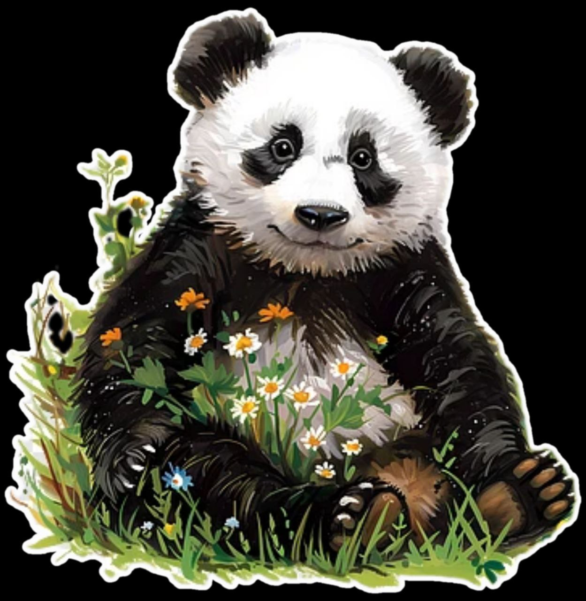

<head>
<meta charset="utf-8">
 <meta name="viewport" content="width=device-width, initial-scale=1.0">
<link href="https://fonts.googleapis.com/css2?family=Amatic+SC:wght@400;700&family=Lora:wght@400;700&display=swap" rel="stylesheet">

<link rel="stylesheet" type="text/css" href="main.css" />
<title>
Bamboo Diaries
</title>
</head>
<body>
<h1>Bamboo Diaries</h1>

 

 
 

<ul>

<li>
<a href="#">The Wilderness|</a> </li>

<li><a href="#">Dark Nights|</a> </li>

<li> <a href="#">Wander Along|</a> </li>
</ul>

 

<h2 style="text-align:left;"> Recently in the wilderness: </h2>

 
Depressed panda finds a way! 

 After a long time the panda has found a way out of his depressing thoughts and he is filled with joy. He awaits the right time to pounce now, panda is in love with the Art now!

